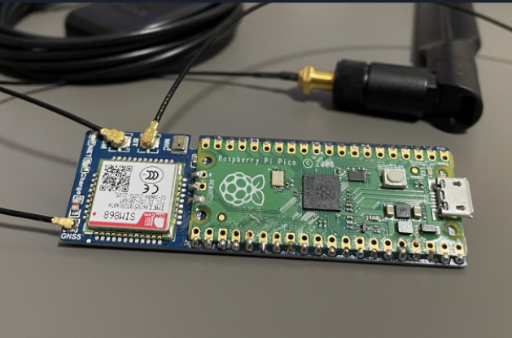
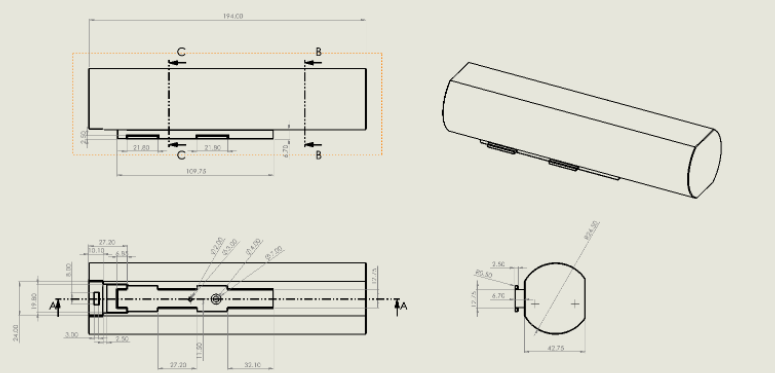
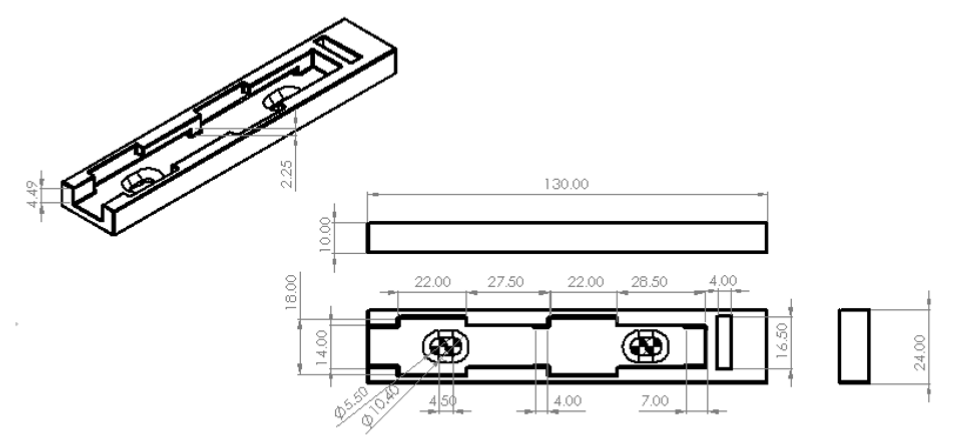
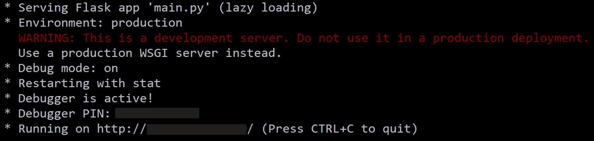

# GPS Map Bike Secuirity Prototype

## About

In Vancouver BC, more than 2000 bicycles are reported as stolen each year. 
Standard bike locks are not enough of a deterrent as they can be easily detached or noticed. 
This Security System allows owners to keep track of their bikes conveniently from any internet enabled device without app installation. 

There is a SIM868 module soldered to a Raspberry Pi Pico which sends collected GPS information to local server over Wi-Fi connection.  

	 

The GPS Coordinates are displayed on a locally hosted webserver. 
This System consists of a mechanical, software, and firmware component. 
The 3D printed enclosure is a compact and light component that may be attached at the water bottle holder or rear saddle. 

	 
	

## Demo
Riding bike on sidewalk within wifi range, updating every 5 seconds:

https://user-images.githubusercontent.com/73859429/163277977-10d36ebd-5bd2-4b48-bb53-4e19b06e04f3.mp4

## Usage

1. Run `pip install flask` and `pip install socket` to install flask and socket modules
    
2. Turn on Locally Hosted Webserver 
	In terminal, navigate to directory containing files and run the following commands:
	* `set FLASK_APP=main.py`
	* `set FLASK_DEBUG=1`
	* `python -m flask run`
	 
	Should show the following, where the last line is a link to the locally hosted website:

	

	
3. Client and Server Setup
	* Run `ipconfig` in terminal to obtain IPv4
	* Set a port number and replace "IPv4 from ipconfig" in server.py & client.py with the obtained IPv4	
	* Run `server.py` in correct directory within terminal
	* Have `client.py` integrated within while loop of python GPS script running on Raspberry Pi Pico

## Directions for using Program
	
	1. Make sure Website and Server are running
	2. Turn on Raspberry Pi Pico containing GPS and client script (supply with power)
	3. Go to Website on local Wi-Fi connected device
	4. Input Customized Password to be routed to updating map html
	5. Move Enclosure or Pi Pico if removed from enclosure, to see change in location on Website

## Work Flow

	- Project rolled out using agile methodology with 2 sprints
	- 1st sprint was focused on creating a connection between the Raspberry Pi Pico and Local Device
	- 2nd sprint was focused on understanding Flask apps and Google maps API used within Javascript 
	  integrated HTML file

## Future Improvements

	1. Create a Website that is accessible from anywhere on any internet connection (possibly HerokuApp)
	2. Make use of GPRS capabilities of SIM868 module to text user in case of significant bike movement
	3. Create database for storage of GPS locations
	4. Deploying the program online so that program is more easily accessable 
	5. Improve password protection as right now it is make shift protection
	6. Make an app that displays battery life, current latitude/longitude, and other functions
	7. Minimize size of of enclosure and system as a whole to reduce visibility
