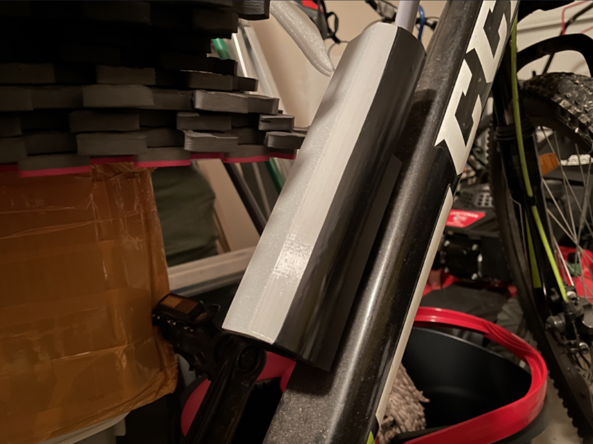

# GPS Map Bike Secuirity Prototype

## About

In Vancouver BC, more than 2000 bicycles are reported as stolen each year. 
Standard bike locks are not enough of a deterrent as they can be easily detached or noticed. 
This Security System allows owners to keep track of their bikes conveniently from any internet enabled device without app installation. 

There is a SIM868 module soldered to a Raspberry Pi Pico which sends collected GPS information to local server over Wi-Fi connection.  

	 

The GPS Coordinates are displayed on a locally hosted webserver. 
This System consists of a mechanical, software, and firmware component. 
The 3D printed enclosure is a compact and light component that may be attached at the water bottle holder or rear saddle. 

	 
	

## Demo

	

## Usage

1. Run `pip install flask` and `pip install socket` to install flask and socket modules
    
2. Turn on Locally Hosted Webserver
	In terminal, navigate to directory containing files and run the following commands:
	* `set FLASK_APP=main.py`
	* `set FLASK_DEBUG=1`
	* `python -m flask run`
	 
	should show the following: 

	

3. Client and Server Setup
	* Run `ipconfig` in terminal to obtain IPv4
	* Set a port number and replace "IPv4 from ipconfig" in server.py & client.py with the obtained IPv4	
	* Run `server.py`
	* Have `client.py` integrated within while loop of python GPS script running on Raspberry Pi Pico

4. Go to webserver (link received from step 2 - last line)
	* password to webpage is within index.html code, can be easily changed by user

## Directions for using Program
	
	1. Enter current availability schedule (availability for the term) & Select "Save Time"
	2. Enter Course Name
	3. Enter description of task for given class
	4. Select Due Date & Due Time for task
	5. Select Difficulty for task (easy, moderate, hard)
	6. Enter Weightage (%) the task has towards final grade 
	7. Select readiness for the given task (not prepared, somewhat prepared, fully prepared)
	8. Click "Generate Summary and Add to Calendar"

Once all steps are completely, user may ignore step 1 and continue to add tasks if needed. 
Once the user has entered all information about particular tasks, the system calculates the suggested time for the user
to spend on the given task. The task is then added to the users Google Calendar with the suggested time of study.

## Work Flow

	- Project rolled out using agile methodology with 2 sprints
	- 1st sprint was focused on creating the task class and ui and then understanding how to work with the Google API 
	- 2nd sprint was focused on integrating all parts and creating a task allocation algorithm 

## Future Improvements

	1. System learns from User to create better required study time equation
	2. Improved UI design
	3. Optimizing algorithms to improve efficieny and space
	4. Deploying the program online so that program is more easily accessable 
